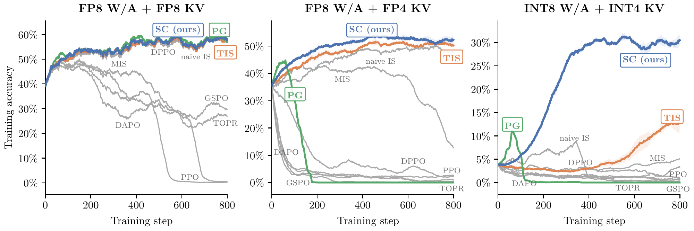

# Score Centering

Official repository for the paper *[Score Centering Stabilizes Off-policy Reinforcement Learning](https://arxiv.org/abs/2609.20807)*

[](https://arxiv.org/abs/2609.20807)

Score centering stabilizes RL under training-inference mismatch (TIM) by canceling *drift*. Score Centering can be used alone or applied on top of importance sampling.



## Score Centering: loss function

We store the sampler's top-k logprobs (k=128) and model the tail with the trainer's distribution, rescaled to match the sampler's tail mass. Both k=128 and k=32 matched full score centering in our experiments.

The implementations below return a loss per token. `train_logp` has shape `[..., V]`; `samp_logp` and `topk_ids` have shape `[..., k]`. Sampled token IDs and logprobs have shape `[...]`; advantages broadcast to that shape. Use float32 logprobs, without renormalizing the top-k head, and retain the sampled token's logprob even when it falls outside the head.

Omit `weight_fn` for score centering alone, or pass `tis_weight` / `mis_weight` to compose it with truncated / masked importance sampling.

<details>
<summary><b>JAX</b></summary>

```python
import jax
import jax.numpy as jnp
from jax.lax import stop_gradient as sg


def score_centering_loss(train_logp, samp_logp, topk_ids, sampled_token,
                         samp_token_logp, advantage,
                         weight_fn=jnp.ones_like, eps=1e-6):
    head_logp = jnp.take_along_axis(train_logp, topk_ids, axis=-1)
    token_logp = jnp.take_along_axis(
        train_logp, sampled_token[..., None], axis=-1)[..., 0]
    p_head, q_head = jnp.exp(head_logp), jnp.exp(samp_logp)
    p_tail = jnp.maximum(1 - p_head.sum(-1), eps)
    q_tail = jnp.maximum(1 - q_head.sum(-1), eps)
    rho = q_tail / p_tail
    alpha = rho * weight_fn(1 / rho)
    head_weight = weight_fn(jnp.exp(head_logp - samp_logp))
    residual = q_head * head_weight - alpha[..., None] * p_head
    correction = (sg(residual) * head_logp).sum(-1)
    token_weight = weight_fn(jnp.exp(token_logp - samp_token_logp))
    return -sg(advantage) * (sg(token_weight) * token_logp - correction)


tis_weight = lambda r: jnp.minimum(r, 2.0)
mis_weight = lambda r: jnp.where((r >= 0.5) & (r <= 5.0), r, 0.0)

# logits: [B, T, V]; advantages: [B]; mask: [B, T] (generated tokens only).
token_loss = score_centering_loss(
    jax.nn.log_softmax(logits.astype(jnp.float32), axis=-1),
    samp_logp, topk_ids, sampled_token, samp_token_logp,
    advantages[:, None], weight_fn=tis_weight)
loss = (token_loss * mask).sum() / jnp.maximum(mask.sum(), 1)
```

</details>

<details>
<summary><b>PyTorch</b></summary>

```python
import torch


def score_centering_loss(train_logp, samp_logp, topk_ids, sampled_token,
                         samp_token_logp, advantage,
                         weight_fn=torch.ones_like, eps=1e-6):
    head_logp = train_logp.gather(-1, topk_ids)
    token_logp = train_logp.gather(-1, sampled_token[..., None])[..., 0]
    p_head, q_head = head_logp.exp(), samp_logp.exp()
    p_tail = (1 - p_head.sum(-1)).clamp_min(eps)
    q_tail = (1 - q_head.sum(-1)).clamp_min(eps)
    rho = q_tail / p_tail
    alpha = rho * weight_fn(1 / rho)
    head_weight = weight_fn((head_logp - samp_logp).exp())
    residual = q_head * head_weight - alpha[..., None] * p_head
    correction = (residual.detach() * head_logp).sum(-1)
    token_weight = weight_fn((token_logp - samp_token_logp).exp())
    return -advantage.detach() * (token_weight.detach() * token_logp - correction)


tis_weight = lambda r: r.clamp_max(2.0)
mis_weight = lambda r: torch.where((r >= 0.5) & (r <= 5.0), r, 0.0)

# logits: [B, T, V]; advantages: [B]; mask: [B, T] (generated tokens only).
# Token IDs must be torch.long; all tensors must be on the same device.
token_loss = score_centering_loss(
    logits.float().log_softmax(-1), samp_logp, topk_ids, sampled_token,
    samp_token_logp, advantages[:, None], weight_fn=tis_weight)
loss = (token_loss * mask).sum() / mask.sum().clamp_min(1)
```

</details>

Full training implementation: [`losses.py`](losses.py).

## Training framework: postax

Score centering was developed in **postax**, a JAX framework I built for LLM full-stack research. This repo includes the full framework, with features beyond score centering:

- pretraining, SFT, DPO, RL
- Llama, Qwen2, Qwen3, Qwen3-MoE (load + save HF checkpoint)
- TP, DP, FSDP, EP

Sampling is JIT-compiled, and sampler logprobs stay in HBM (no CPU roundtrip)!

## Example: RL run

Defaults live in each trainer; override them with `key=value` arguments. For Qwen3-0.6B on Countdown with score centering:

```bash
python train_rl.py model.source=Qwen/Qwen3-0.6B \
  env.id=countdown env.prompt_format=chat \
  rl.sc=true sampler.vocab_logprobs=128 \
  opt.optimizer=sgd opt.lr=0.01
```

Use `log.wandb_mode=disabled` to run without W&B. Models are cached in `~/.cache/postax/weights`; configurations and metrics go to `outputs/`. Pretraining/SFT and DPO use `train_lm.py` and `train_dpo.py`.

## Paper sweeps

Paper configurations are in [`sweeps/`](sweeps/). Each YAML is a W&B grid sweep for one figure:

| Sweep | Experiment | Runs per seed |
| --- | --- | ---: |
| [2b_online_vs_offline](sweeps/2b_online_vs_offline.yaml) | 1.7B Countdown: reward modes, online vs. offline | 6 |
| [06b_weight_noise](sweeps/06b_weight_noise.yaml) | 0.6B Countdown: synthetic weight noise | 36 |
| [06b_quant_stale](sweeps/06b_quant_stale.yaml) | 0.6B Countdown: quantization and staleness | 26 |
| [30b_math](sweeps/30b_math.yaml) | 30B INTELLECT-2 math: quantization | 30 |
| [topk](sweeps/topk.yaml) | Score centering with k=32, k=128, or full logprobs | 27 |

## Install

On Linux with CUDA, run from the repository root:

```bash
uv venv --python 3.13
source .venv/bin/activate
uv pip install -r requirements.txt "jax[cuda12]"
```

The math experiments additionally need:

```bash
uv pip install -r requirements.txt "intellect-math==0.1.7" \
  --extra-index-url https://hub.primeintellect.ai/primeintellect/simple/
```

## Citation

If you use Score Centering in your work or find our results useful, please consider citing our paper as follows:

```
@misc{marek2026scorecentering,
      title={Score Centering Stabilizes Off-policy Reinforcement Learning}, 
      author={Martin Marek and Max Ryabinin},
      year={2026},
      eprint={2609.20807},
      archivePrefix={arXiv},
      primaryClass={cs.LG},
      url={https://arxiv.org/abs/2609.20807}, 
}
```
